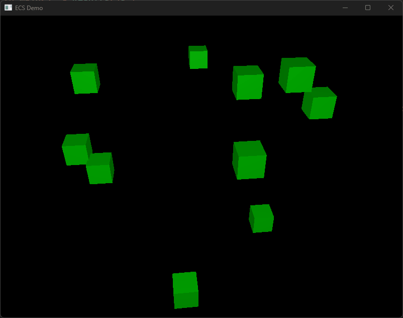

# An Entity Component System in Rust

This is a small ecs implementation in Rust that demonstrates storing and accessing column oriented data while still ensuring memory safety.

# Example

To run the example:

```
cargo run -r --example cubes
```

This demonstrates adding `entities` to a `World`, assigning components to those entities, and mutating component data using a `system` that iterates over component vectors to find the `relevant_entities`.


